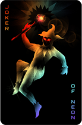

# Cards

## Deck
Players start with a traditional deck of 52 cards with cards of 13 ranks and 4 suits, clubs, diamonds, hearts and spades + 2 regular jokers. As they win rounds, they can enhance their deck through the shop by purchasing common and modifier cards. This allows players to choose the type of deck they want to build according to their strategy.

## Types of Cards:

* Traditional cards: used to form classic poker plays (pair, flush, straight, etc.)
* Neon cards: are variants of traditional cards that score double points and +1 multi. Also, when a play is formed only with neon cards, the play level is increased by 4, scoring more points and multi.
* Modifier cards: which can be applied to traditional cards individually to achieve different effects, like changing suit or transforming the card into a different one.
* Special cards: which apply global effects that can affect specific cards or the game itself. There are two types:
    * Permanent
    * Temporary: self-destruct after 3 rounds
* Jokers: wildcard that will be used to complete the best possible hand.

## Jokers
​
| NAME             | IMAGE | DESCRIPTION                                           | 
|------------------|------------|-------------------------------------------------------|
|  Joker           |            | Adds 100 points and 1 multi       |
|  Neon Joker      |       | Adds 200 points and 2 multi       |