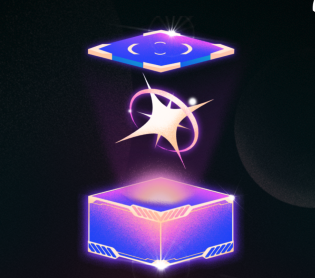

# Loot Boxes

## C-Grade Loot Boxes

| NAME                  | APPEARANCE | Description                                      | Details                                                                 |
|-----------------------|------------|--------------------------------------------------|-------------------------------------------------------------------------|
| Basic        || Contains mostly traditional cards and modifiers | 2% chance of getting a special card 5% chance of getting a modifier card 4% chance of getting a Joker 1% chance of getting a Neon Joker 88% chance of getting a traditional card Loot box size 5 |
| Figures     || Contains mostly figure cards                     | 70% chance of getting a figure 30% chance of getting other traditional cards Loot box size 5 |
| The Lovers   || All hearts suited cards, can contain special cards and modifiers. | 45% chance of getting a traditional Heart card 30% chance of getting Ace of Hearts 10% chance of getting Neon Heart card 10% chance of getting Heart Suit modifier 5% chance of getting 'All cards to heart' special Loot box size 5 |

## B-Grade Loot Boxes

| NAME                  | APPEARANCE | Description                                      | Details                                                                 |
|-----------------------|------------|--------------------------------------------------|-------------------------------------------------------------------------|
| Advanced     || Can contain a special card or joker              | 4% chance of getting a special card 10% chance of getting a modifier card 8% chance of getting a Joker 2% chance of getting a Neon Joker 76% chance of getting a traditional card Loot box size 5 |
| Jokers       || More chances of getting a Joker                  | 15% chance of getting a Joker 1% chance of getting a Neon Joker 84% chance of getting a traditional card Loot box size 3 |
| Modifiers    || Contains mostly modifiers                        | 50% chance of getting a modifier 50% chance of getting a traditional card Loot box size 5 |
| Special Bet  || Small loot box with chances of getting a special card or modifier | 5% chance of getting a special card 10% chance of getting a modifier 85% chance of getting a traditional card Loot box size 3 |

## A-Grade Loot Boxes

| NAME                        | APPEARANCE | Description                                      | Details                                                                 |
|-----------------------------|------------|--------------------------------------------------|-------------------------------------------------------------------------|
| Specials           || More chances of getting a special card           | 15% chance of getting a special card 20% chance of getting a modifier 65% chance of getting a traditional card Loot box size 3 |
| The Deceitful Joker|| 1 guaranteed Joker                               | 1 guaranteed Joker 6% chance of getting a Joker 2% chance of getting a Neon Joker 92% chance of getting a traditional card Loot box size 3 |
| Neon               || An exclusive loot box with chances of getting neon cards | 97% chance of getting a neon card 3% chance of getting a Neon Joker Loot box size 5 |
