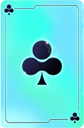
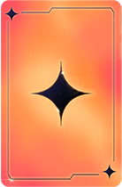
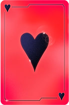
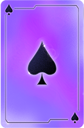
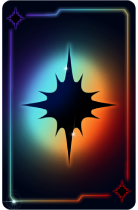

# Modifier Cards

Modifier cards have individual effects that can be applied to specific cards.

## Pricing and Value

| TIER | BUY/SELL VALUE |
| ---- | -------------- |
| B    | 300            |
| A    | 750            |
| S    | 1000           |

## Current Modifier Cards

| ID  | NAME               | IMAGE                        | DESCRIPTION                                             | TIER |
| --- | ------------------ | ---------------------------- | ------------------------------------------------------- | ---- |
| 608 | Change to Clubs    |  | The modified card will be considered as a Clubs card    | B    |
| 609 | Change to Diamonds |  | The modified card will be considered as a Diamonds card | B    |
| 610 | Change to Hearts   |  | The modified card will be considered as a Hearts card   | B    |
| 611 | Change to Spades   |  | The modified card will be considered as a Spades card   | B    |
| 612 | Change to Neon     |  | The modified card will be considered as a Neon card     | S    |
| 613 | Wildcard           |  | The modified card will be considered as a Wildcard      | A    |
