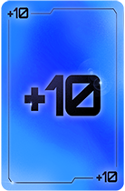
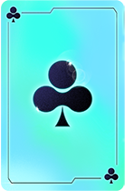

# Modifier Cards

| NAME             | APPEARANCE | DESCRIPTION                                           | REGULAR PRICE | PROBABILITY |
|------------------|------------|-------------------------------------------------------|---------------|-------------|
| plus 10 Points   || The modified card will score +10 additional points     | 100           | 12.4%       |
| plus 20 Points   || The modified card will score +20 additional points     | 200           | 8.2%        |
| plus 50 Points   || The modified card will score +50 additional points     | 300           | 6.2%        |
| plus 100 Points  || The modified card will score +100 additional points    | 600           | 3.1%        |
| plus 1 muli      || The modified card will add +1 to the multi             | 200           | 10.3%       |
| plus 2 muli      || The modified card will add +2 to the multi             | 300           | 6.2%        |
| plus 5 muli      || The modified card will add +5 to the multi             | 600           | 3.1%        |
| plus 10 muli     || The modified card will add +10 to the multi            | 2000          | 1.0%        |
| Change to Clubs  || The modified card will be considered as a Clubs card   | 100           | 12.4%       |
| Change to Diamonds || The modified card will be considered as a Diamonds card| 100           | 12.4%       |
| Change to Hearts || The modified card will be considered as a Hearts card  | 100           | 12.4%       |
| Change to Spades || The modified card will be considered as a Spades card  | 100           | 12.4%       |
