# Rage Cards

Rage cards have negative effects that will challenge players in specific rounds.

## List of Rage cards

| NAME               | IMAGE                        | DESCRIPTION                                                      |
| ------------------ | ---------------------------- | ---------------------------------------------------------------- |
| Broken Hearts      | 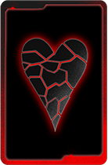 | Heart suited cards will not score during this level              |
| Broken Clubs       | 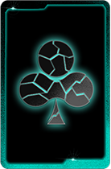 | Club suited cards will not score during this level               |
| Broken Diamonds    | 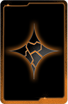 | Diamond suited cards will not score during this level            |
| Broken Spades      | 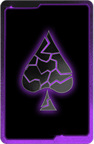 | Spade suited cards will not score during this level              |
| Broken Jokers      | 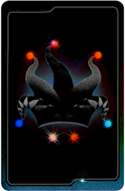 | Jokers will not score during this level                          |
| Diminished Hold    | 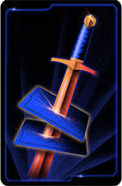 | Your hand will be reduced by 2 cards during this level           |
| Zero Waste         | 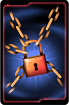 | You have no discards during this level                           |
| Strategic Quartet  | 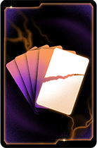 | You can only play up to 4 cards during this level                |
| Broken Figures     | 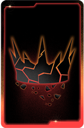 | Figures (Jack, Queen, and King) will not score                   |
| The Hand Leech     | 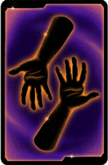 | 2 hands less to play                                             |
| Double Trouble     | 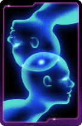 | You have to make double points in this round                     |
| Betraying the Weak | 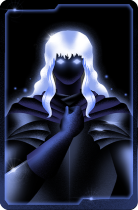 | Cards with a value of 5 or less will not score during this level |

<!--
| Unexpected Sacrifice |  | One of your special cards got sacrificed                         |
| Dynamic Tactics      | 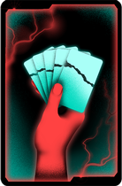 | The same hand cannot be played twice                             |
| Balanced Trade-off   | 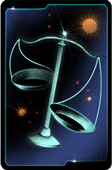 | A poker play is worth double, another half                       |
| Broken Modifiers     | 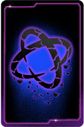 | Modifiers will not work during this level                        |
| Last Words           | 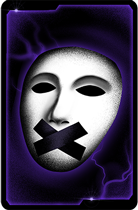 | Silence the most repeated card in the deck                       |
| Greedy Trap          | 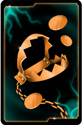 | Deduct 200 for each hand played and 100 for each discard         |
| Spider’s Snare       | 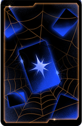 | Special cards have no effect on the first hand played            |
| Perpetual Curse      | 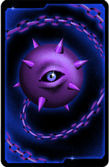 | Silence a random card in each hand played                        |
-->
