# Special Cards

Special cards have global effects that can affect specific cards or the game itself. They can be purchased as permanent or temporary (self-destruct after 3 rounds).

Rarity determines the price of the card:

| Rarity    | Price | Temporary Price |
| --------- | ----- | --------------- |
| Common    | 1000  | 300             |
| Uncommon  | 1750  | 600             |
| Rare      | 3500  | 1200            |
| Epic      | 5000  | 1700            |
| Legendary | 7000  | 2300            |

## List of Special cards

| NAME                    | CARD                         | EFFECT                                                                                              | RARITY    |
| ----------------------- | ---------------------------- | --------------------------------------------------------------------------------------------------- | --------- |
| Multiplied Hearts       | 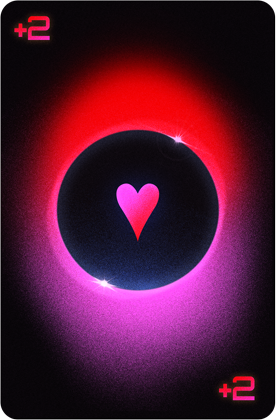 | Adds +2 multi for every played Heart suited card                                                    | Common    |
| Multiplied Clubs        |  | Adds +2 multi for every played Clubs suited card                                                    | Common    |
| Multiplied Diamonds     | 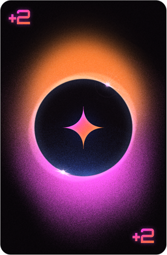 | Adds +2 multi for every played Diamonds suited card                                                 | Common    |
| Multiplied Spades       | 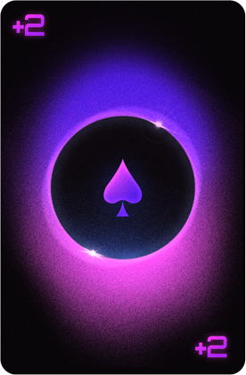 | Adds +2 multi for every played Spades suited card                                                   | Common    |
| Pair Booster            | 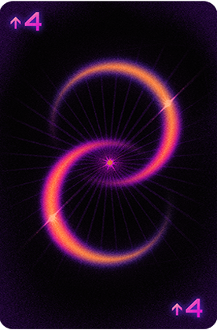 | Level up PAIR hand by 4 levels                                                                      | Common    |
| Two Pair Booster        | 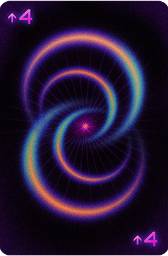 | Level up TWO PAIR hand by 4 levels                                                                  | Common    |
| Straight Booster        | 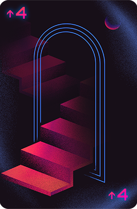 | Level up STRAIGHT hand by 4 levels                                                                  | Uncommon  |
| Flush Booster           |  | Level up FLUSH hand by 4 levels                                                                     | Uncommon  |
| Easy Straight           |  | Straight hand can be done with 4 cards                                                              | Uncommon  |
| Easy Flush              |  | Flush hand can be done with 4 cards                                                                 | Uncommon  |
| Joker Booster           | 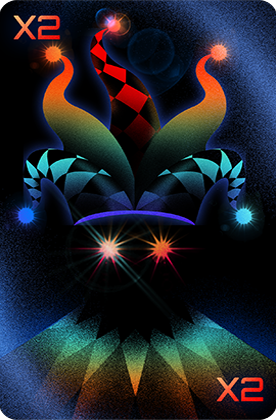 | All played Jokers scores double points and double multi                                             | Epic      |
| Power-up Booster        |  | All played Power-ups scores double points and double multi                                          | Legendary |
| Figures Booster         |  | All played FIGURES cards scores +50 points                                                          | Rare      |
| Multiplied Aces         |  | Adds +5 multi for every played Ace card                                                             | Uncommon  |
| Love is in the air      | 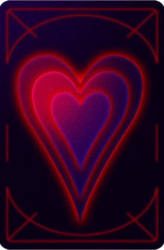 | All played cards are considered Heart suited                                                        | Rare      |
| The hand thief          |  | Adds +1 hands and +1 discards to the round                                                          | Rare      |
| Extra help              | 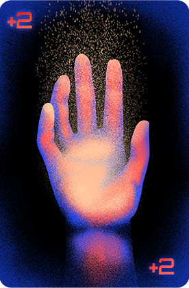 | Increase hand size by 2                                                                             | Epic      |
| Lucky 7                 |  | All 7s scores +77 points                                                                            | Rare      |
| Neon bonus              |  | All Neon cards scores +20 points. Neon plays are leveled up by 2 extra levels.                      | Rare      |
| Deadline                |  | When playing your last hand, increase the play level 10 times                                       | Rare      |
| Initial advantage       |  | The first played hand scores +100 points and +10 multi                                              | Rare      |
| Lucky hand              |  | Adds +50 cash for every Diamond suited card played                                                  | Uncommon  |
| Discard mastery         |  | Adds +10 multi if you have no discards left                                                         | Uncommon  |
| Second chance           |  | When you lose, this card gets destroyed but you can continue playing                                | Epic      |
| Guardian's shield       | 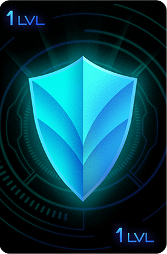 | Blocks all rage cards for 1 level. Gets destroyed afterwards                                        | Epic      |
| Neon synergy            |  | If more than 50% of the played cards are neon, all the other cards get converted to neon            | Rare      |
| Neon Doctrine           |  | Convert two played cards into neon cards                                                            | Common    |
| Blackjack               | 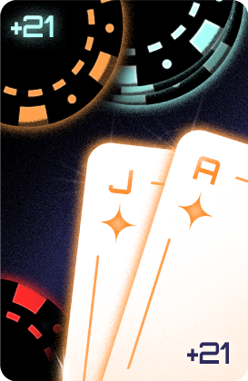 | Hit exactly 21 points with your played cards to gain +21 multi                                      | Common    |
| Efficient Play          | 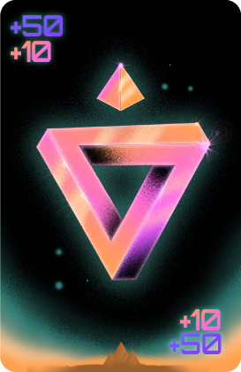 | Earn +10 multi and +50 points when playing 3 or fewer cards                                         | Rare      |
| Special Sacrifice       | 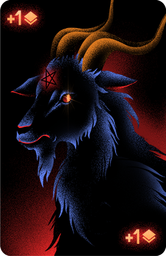 | Gain +1 multi (stacking) for every special card sold                                                | Epic      |
| Rage Breaker            | 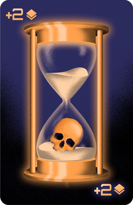 | Gain +2 multi (stacking) for each Rage defeated                                                     | Rare      |
| Shortcut                | 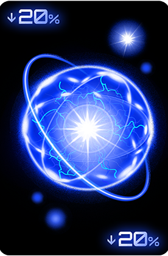 | Reduces the points needed to beat the level by 20%                                                  | Epic      |
| Lucky Payday            | 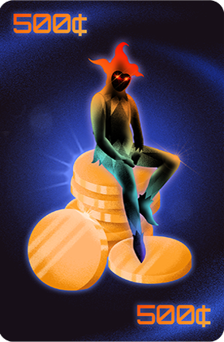 | Get extra 500 cash for every Joker in hand at the end of the round                                  | Uncommon  |
| Loot boxes on sale      |  | Loot boxes have 30% discount                                                                        | Common    |
| Joker's drop            |  | Get 500 cash every time you discard a Joker                                                         | Uncommon  |
| Extra drops             |  | Adds 2 discards                                                                                     | Rare      |
| Extra draws             |  | Adds 2 plays                                                                                        | Rare      |
| Wild deuces             |  | All 2s are considered wildcards                                                                     | Uncommon  |
| Undying Draw            |  | First discarded hand gets leveled up                                                                | Rare      |
| Full House Booster      | 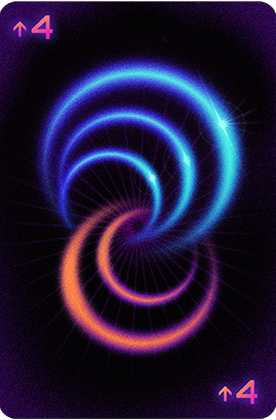 | Level up Full House hand by 4 levels                                                                | Rare      |
| Three of a Kind Booster |  | Level up Three of a Kind hand by 4 levels                                                           | Uncommon  |
| Four of a Kind Booster  | 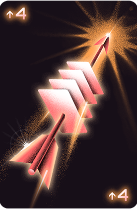 | Level up Four of a Kind hand by 4 levels                                                            | Rare      |
| Five of a Kind Booster  | 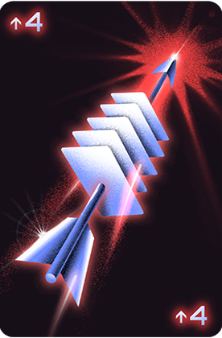 | Level up Five of a Kind hand by 4 levels                                                            | Uncommon  |
| Dice of Hearts          | 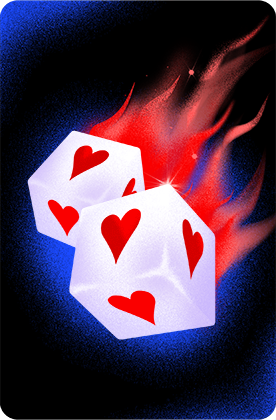 | Rolls a number between -2 and 6 to add to the multi for each played Hearts suited card              | Uncommon  |
| Dice of Clubs           | 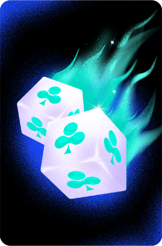 | Rolls a number between -2 and 6 to add to the multi for each played Clubs suited card               | Uncommon  |
| Dice of Diamonds        | 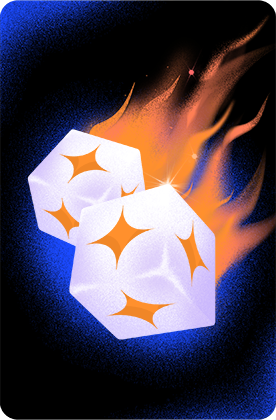 | Rolls a number between -2 and 6 to add to the multi for each played Diamonds suited card            | Uncommon  |
| Dice of Spades          | 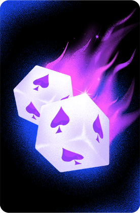 | Rolls a number between -2 and 6 to add to the multi for each played Spades suited card              | Uncommon  |
| Special Multiplier      |  | Gain +3 multi for each active special card                                                          | Uncommon  |
| Deck Collector          | 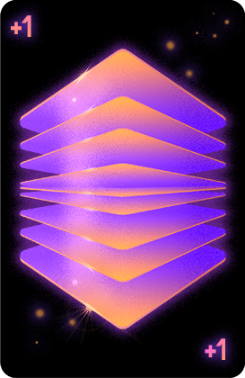 | Earn +1 point for every card in your deck                                                           | Uncommon  |
| Burning Rewards         | 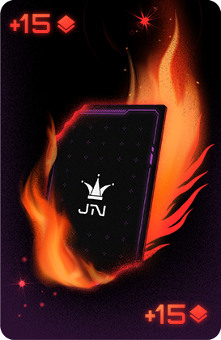 | Gain +15 points (stacking) for each card burned.                                                    | Epic      |
| Slot Saver              | 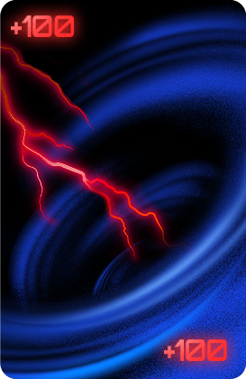 | Earn +100 points for each unlocked but empty card slot                                              | Common    |
| High Rollers            | 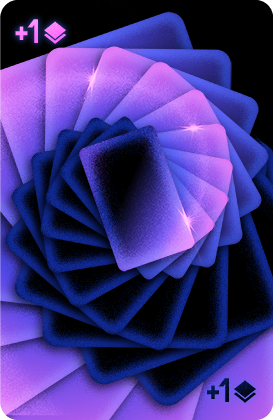 | 1 in 2 chance to gain +1 multi (stacking) for each High Card.                                       | Epic      |
| Spade Trio              | 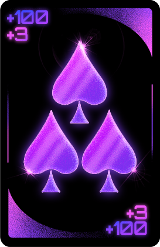 | If hand contains at least 3 Spade cards, gain +100 points and +3 multi                              | Uncommon  |
| Twos Matter             | 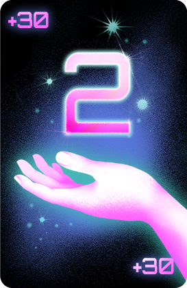 | Gain +30 points for every 2 held in your hand                                                       | Common    |
| Hand of modifiers       | 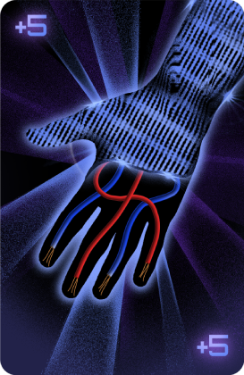 | Gain +5 multi for each modifier card held in your hand                                              | Common    |
| Pyromaniac              | 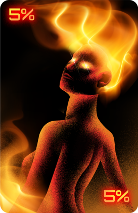 | 50% discount on burn cards                                                                          | Common    |
| Quad Multiplier         | 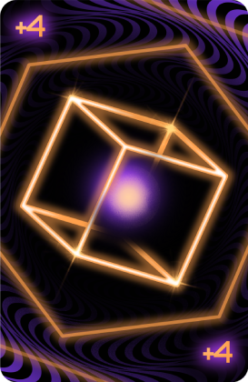 | +4 multi for every 4 held in your hand                                                              | Epic      |
| Jackpot                 | 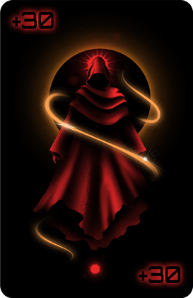 | Gain +30 points for every Jack held in your hand                                                    | Uncommon  |
| Cash loop               | 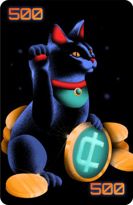 | Earn +50% rewards after each level                                                                  | Common    |
| Specials Hunter         | 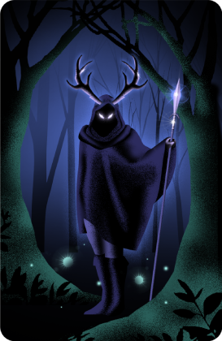 | Double the probability of finding A and S specials in the store                                     | Common    |
| King's Faith            | 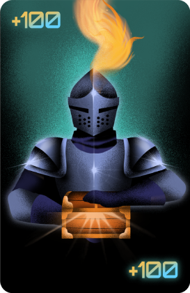 | Kings played have 1 in 2 chance to give 100 cash; held Kings have 1 in 4 chance to score 100 points | Uncommon  |
| Arithmomania            |  | If sum of played cards is even: +7 multi. If odd: +100 points                                       | Uncommon  |
| Black and Red           |  | Hearts and Diamonds: double points. Clubs and Spades: +1 multi                                      | Epic      |
| Worthless Jokers        | 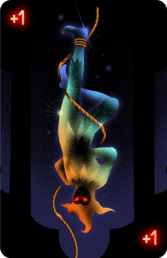 | Jokers score 0. All other cards get +1 multi                                                        | Common    |
| Rising Ladder           |  | +10 cumulative points for every straight played.                                                    | Epic      |
| Relativity              | 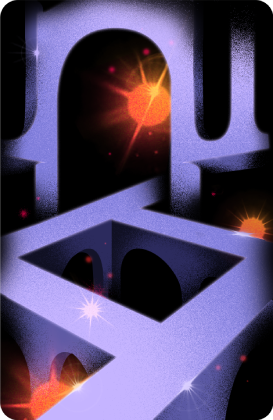 | Converts any straight into a 10-Ace straight                                                        | Common    |
| Wildcard Booster        |  | Each Wildcard grants +100 points                                                                    | Uncommon  |
| Rainbow                 | 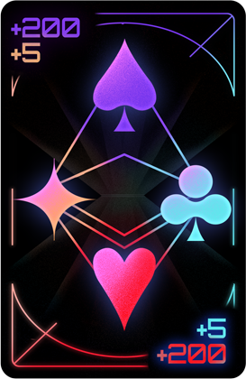 | Gain +200 points and +5 multi if play includes all four suits                                       | Epic      |
| Queens Fortune          | 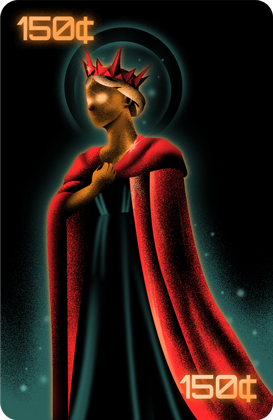 | Scoring Queens have 1 in 2 chance to give +150 cash                                                 | Uncommon  |

<!-- | Mirror effect |  | Repeats the effect of the special card to the left | Uncommon |
| Bonus Picks | 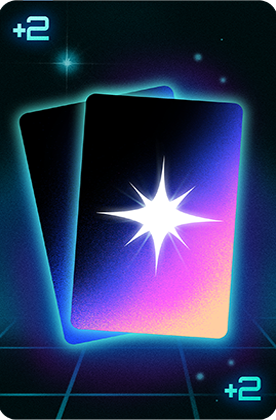 | 2 extra special card options in the store | Common |
| Scaling factor | 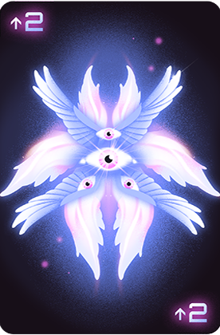 | Upgrade all your hands by 2 levels | Rare |
| Shielded Start | 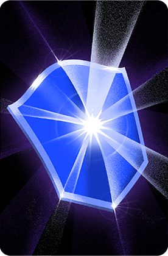 | Protects your first played hand from all negative effects | Rare |
| Fury Reset | 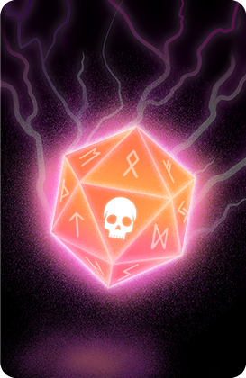 | Allows rerolling Rage cards once per round. Costs 500 per Rage card in the round | Rare |
| Skip Bonus | 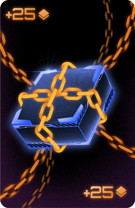 | Gain +25 points (stacking) for each loot box skipped. Currently +{{points}} points | Rare |
| Suit Roulette | 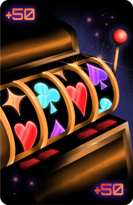 | Gain +5 multi for every card matching a randomly chosen suit. Suit changes each round | Rare |
| Club Keeper | 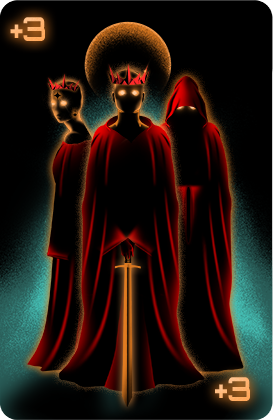 | Earn +10 points for each Club card in your deck | Rare |

-->
