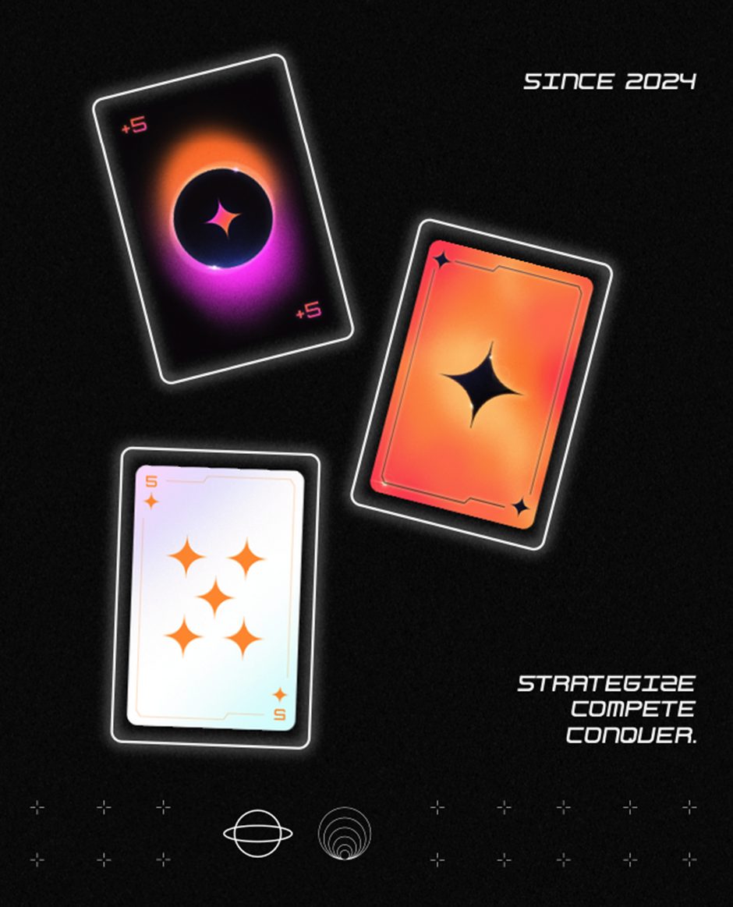

# Key Features

* Free-to-Play Model: Players can enjoy the game without any initial cost, making it accessible to a wide audience.

* Mobile Compatibility: The game is designed to be played seamlessly on mobile devices.

* Accessibility for Non-Crypto Users: We aim to provide a user experience similar to traditional web2 applications by utilizing Cartridge Controller. This allows players to engage with the game without needing prior knowledge of blockchain technology.

* Enhanced Design and User Experience (UX): Our strong focus on design ensures a visually appealing and immersive experience.

* Collaborating with professional designers, we are committed to delivering a high-quality interface that enhances gameplay.

* Regular Updates and Special Events: Special themed events and regular content updates keep the game fresh and exciting, providing new challenges and opportunities for players to explore.

