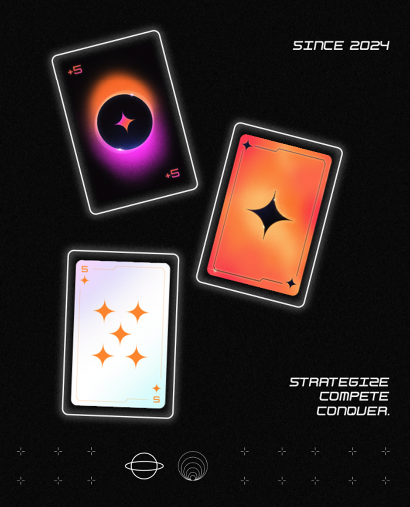

# Key Features

* Free-to-Play: Players can enjoy the game without any initial cost, making it accessible to a wide audience.

* Mobile first: The game is designed to be played seamlessly on mobile devices as well as desktops, ensuring a consistent and user-friendly experience across all platforms.

* Global tournaments, where top players can get rewarded, with weekly leaderboards and special events.

* Modding: Jokers of Neon will provide a community-driven platform where players will be able to build mods and create businesses on top of their contributions.

* Accessibility for Non-Crypto Users: We aim to provide a user experience similar to traditional web2 applications by utilizing Cartridge Controller. This allows players to engage with the game without needing prior knowledge of blockchain technology.

* Regular Updates and Special Events: Special themed events and regular content updates keep the game fresh and exciting, providing new challenges and opportunities for players to explore.

