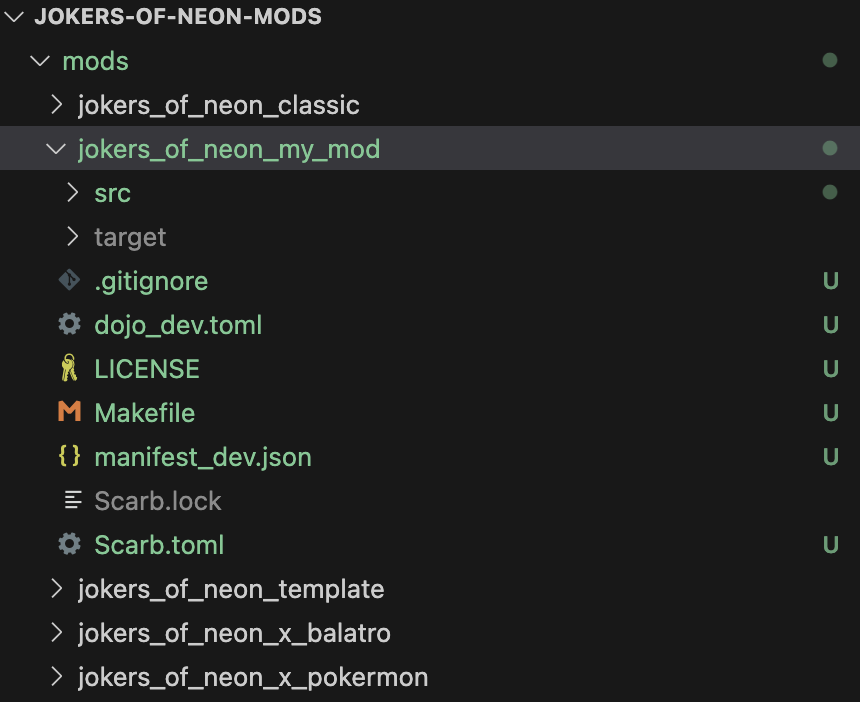
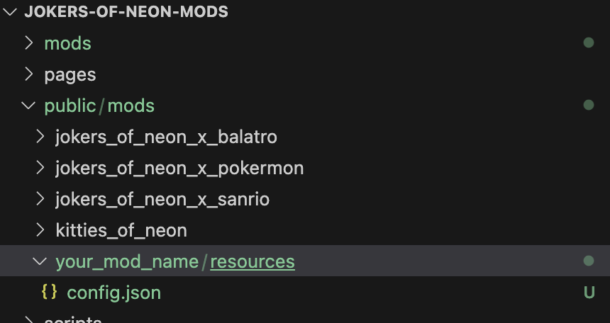
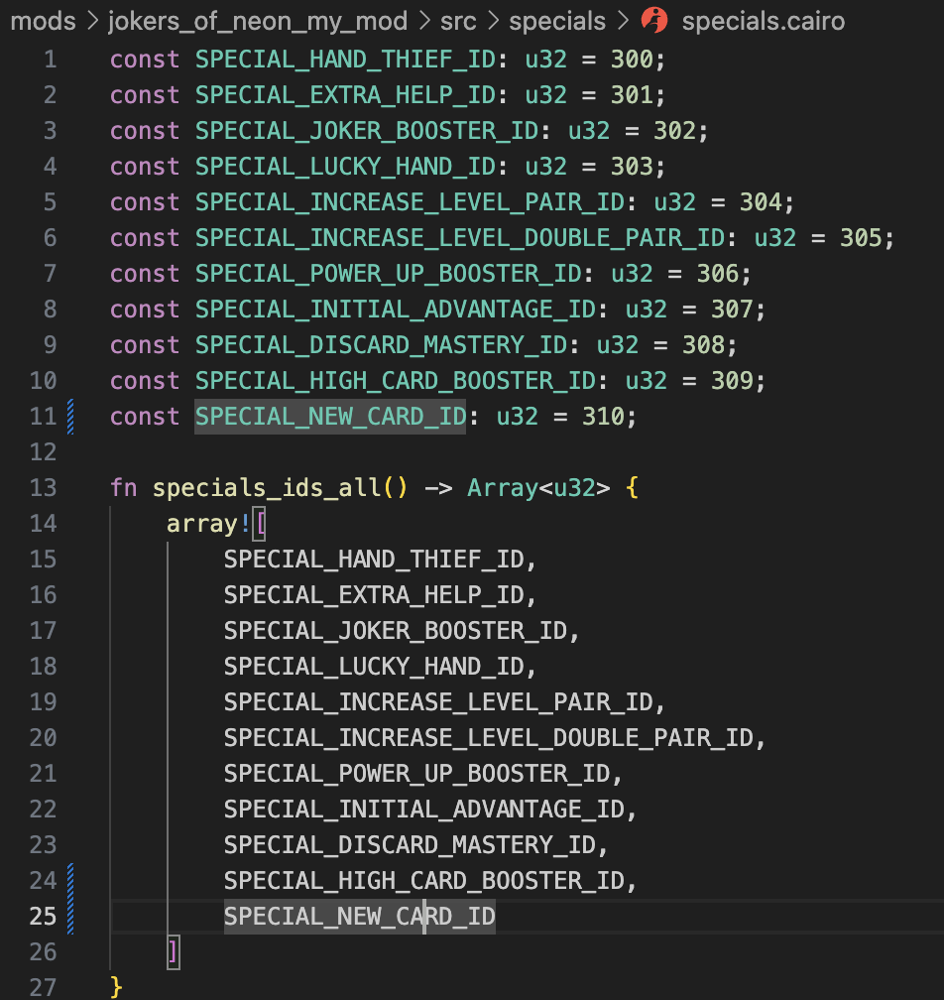
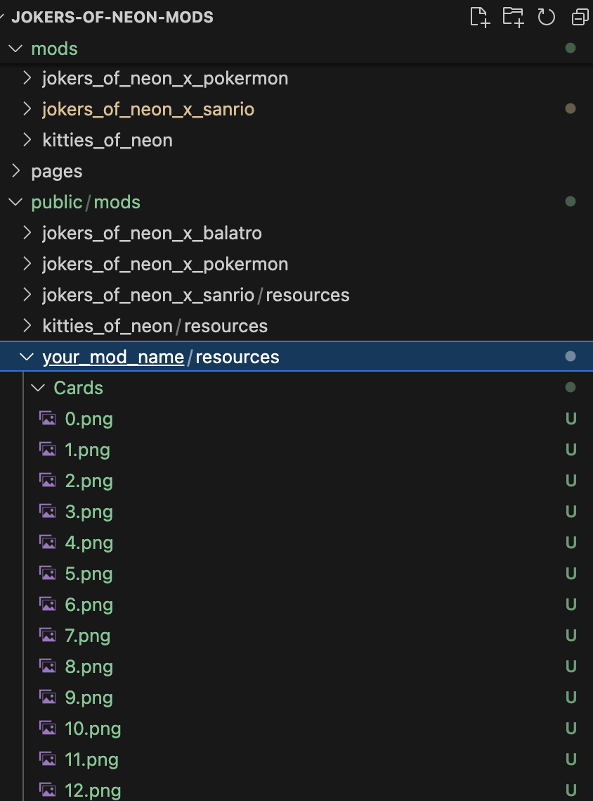

# Modding

Welcome to the _Jokers of Neon Modding Docs!_ This guide will help you create and customize mods to enhance gameplay, tweak game mechanics, and introduce new visuals.

With the mods, you can:

- Customize initial game configurations.
- Set up a personalized shop.
- Create unique deck setups.
- Design new special cards, rage cards, and loot boxes with distinct effects.
- Replace visual elements such as card designs, borders, and backgrounds.

## Step-by-Step Tutorial: Creating Your First Mod

### Initial Setup

1. Clone this repo and create your own branch

```bash
git clone https://github.com/caravana-studio/jokers-of-neon-mods.git
git checkout -b your-mod-name
```

2. Navigate to the `mods` folder in your game directory
3. Inside the mods folder, copy the `jokers_of_neon_template` folder and change it's name.

> Use underscores to separate words in the folder name for your mod



> You can execute this command from the root of the project:
>
> ```bash
> cp -r mods/jokers_of_neon_template mods/your_mod_name
> ```

Every mod follows this basic structure:

```bash
└── mods/
    └── MOD_NAME/
        └── src/
            ├── configs/
            │   ├── game/
            │   └── shop/
            ├── specials/
            │   ├── special_game_type/
            │   ├── special_individual/
            │   ├── special_poker_hand/
            │   ├── special_power_up/
            │   ├── special_round_state/
            │   └── specials/
            ├── rages/
            │   ├── game/
            │   ├── round/
            │   ├── silence/
            │   └── rages/
            ├── lib.cairo
            └── loot_box.cairo
└── public/mods/MOD_NAME/resources
```

### Adding Basic Mod Details

This information is used to display your mod on the game's page.

> All files must be uploaded to your mod's resources folder: `/public/mods/MOD_NAME/resources/`

---

#### Create a Mod Configuration File

In the mod's resources folder, create a `config.json` file containing essential details about your mod. Use the following structure:

```json
{
  "name": "My awesome JN Mod",
  "description": "Brief description of your mod"
}
```



---

#### Add Preview Image

To customize the mod's preview image, upload an image named `thumbnail.png` to the same directory as `config.json`.

---

### Modifying the Default Configuration

#### Game Configuration

You can modify the initial game settings to create a more challenging experience while offering certain advantages. These parameters are defined in:
`mods/(MOD_NAME)/src/configs/game.cairo.`

Below is an example configuration with adjusted values for `plays`, `discards`, `hand size`, and `starting cash`:

```rust
GameConfig {
    plays: 2,                    // Number of plays per round
    discards: 7,                 // Number of discards allowed
    max_special_slots: 5,        // Maximum number of special slots
    power_up_slots: 4,           // Number of active power up slots
    max_power_up_slots: 4,       // Maximum number of power up slots
    hand_len: 10,                 // Starting hand size
    start_cash: 10000,           // Starting cash amount
    start_special_slots: 1,      // Number of special card slots active at the start of the game
}
```

---

#### Shop Configuration

You can customize the shop to show more special cards and fewer traditional cards or loot boxes, tailoring the experience to your mod. The shop configuration is located in:
`mods/mod_name/src/configs/shop.cairo`.

Example of a customized shop configuration:

```rust
ShopConfig {
    traditional_cards_quantity: 2,    // Regular cards in shop
    modifiers_cards_quantity: 3,      // Modifier cards in shop
    specials_cards_quantity: 5,       // Special cards in shop
    loot_boxes_quantity: 1,           // Loot boxes in shop
    power_ups_quantity: 2,            // Power ups in shop
    poker_hands_quantity: 3           // Poker hands available to level up in shop
}
```

---

### Implementing your first Special Card

In this section, we’ll create a special card that rewards `points`, `multiplier`, and `cash` when the player has a HighCard hand.
All special cards must be defined in `mods/mod_name/src/specials/specials.cairo`, with each card assigned a unique ID between `300` and `400`.

#### Define the Card ID

Open `mods/mod_name/src/specials/specials.cairo` and add the unique ID for your new Special Card:

```rust
const SPECIAL_NEW_CARD_ID: u32 = 310;
```

#### Register the Card in the Game

Add the new card id into the `*specials_ids_all*` function :

```rust
  fn specials_ids_all() -> Array<u32> {
  array![
      ....,
      SPECIAL_NEW_CARD_ID
  ]}
```



Assign the card to a group to make it purchasable in the shop. _For example, add it to the `SS group`_:
Groups define the probability the card has for appearing in the shop and also its cost.
You can also adjust the probabilities and costs for each group. Ensure that the probabilities of all defined groups add up to 100.

```rust
let SS_SPECIALS = array![..., SPECIAL_NEW_CARD_ID].span();
```

#### Create the Implementation File

Since this card is specific to `PokerHand` functionality, its type will be `SpecialType::PokerHand`. Navigate to the `mods/mod_name/src/specials/special_poker_hand/` directory and create a new file named `high_card_booster.cairo`. Add the implementation for your new card in this file.

After that whe should go to `src/lib.cairo` and add this line to include our new module:

```rust
  mod high_card_booster;
```

---

##### Example Implementation

Below is an example of how to implement the HighCard Booster special card:

```rust
#[dojo::contract]
pub mod special_high_card_booster {
    use jokers_of_neon_classic::specials::specials::SPECIAL_HIGH_CARD_BOOSTER_ID;
    use jokers_of_neon_lib::interfaces::poker_hand::ISpecialPokerHand;
    use jokers_of_neon_lib::models::data::poker_hand::PokerHand;
    use jokers_of_neon_lib::models::play_info::PlayInfo;
    use jokers_of_neon_lib::models::special_type::SpecialType;

    #[abi(embed_v0)]
    impl SpecialHighCardBoosterImpl of ISpecialPokerHand<ContractState> {
        fn execute(ref self: ContractState, play_info: PlayInfo) -> ((i32, Span<(u32, i32)>), (i32, Span<(u32, i32)>), (i32, Span<(u32, i32)>)) {
            if play_info.hand == PokerHand::HighCard {
                ((100, array![].span()), (20, array![].span()), (500, array![].span()))
            } else {
                ((0, array![].span()), (0, array![].span()), (0, array![].span()))
            }
        }

        fn get_id(ref self: ContractState) -> u32 {
            SPECIAL_HIGH_CARD_BOOSTER_ID
        }

        fn get_type(ref self: ContractState) -> SpecialType {
            SpecialType::PokerHand
        }
    }
}
```

##### Key Methods Explained

- `get_id()`: Returns the unique ID of the card.
- `get_type()`: Defines the card as a PokerHand type.
- `execute()`: Implements the card’s effect. In this case:
  - _HighCard Hand_: Rewards 100 points, 20 multiplier, and 500 cash.
  - _Other Hands_: Rewards 0 points, 0 multiplier, and 0 cash.

---

#### Making Special Cards Available to the Frontend

To ensure your special cards are accessible in the frontend, follow these steps:

##### Update the Card Metadata

Navigate to `/public/mods/(MOD_NAME)/resources/` and update the `specials.json` file to include the name and description of your special cards.

_For example_:

```json
{
  "CardID": {
    "name": "Card Name",
    "description": "Card Description"
  },
  "349": {
    "name": "Random Diamond Joker",
    "description": "Adds a number between -2 and 6 to the multiplier for each Diamonds-suited card played."
  },
  "355": {
    "name": "Extra",
    "description": "Demo"
  }
}
```

> Replace CardID with the unique ID of your card. For the card we implemented earlier, use `309`.

---

##### Add the Card Image

Upload an image for your special card to the following directory:
`/public/mods/(MOD_NAME)/resources/Cards/{cardID}.png`

> Replace `{cardID}` with the unique ID of your card. For the example card, the image file should be named `309.png`



#### Deploy Your Mod

Rename the `.env_example` file to `.env`

Run the deploy command:

```bash
make deploy-mod mod_name=your_mod_name
```

### 2.5. Create a PR on this repository

Once you have completed the implementation of your mod including _frontend assets_ and _cairo code_, create a pull request to this repository.
