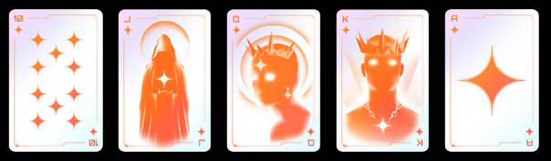

# Plays
Poker Hands are sets of between one and five cards that can be played to obtain Points and Multi for scoring. Each hand also has a level that affects its potency.

In a game, all Hands start at Level 1 and are improved through the shop.

| NAME            | POINTS & MULTI | DESCRIPTION                                     | EXAMPLE              |
|-----------------|---------------|--------------------------------------------------|----------------------|
| High Card       | 5 Points x 1 Multi | The highest single card when no other hand is made. ||
| Pair            | 10 Points x 2 Multi | Two cards of the same rank.                    ||
| Two Pair        | 20 Points x 2 Multi | Two different pairs of cards.                  ||
| Three of a Kind | 30 Points x 3 Multi | Three cards of the same rank.                  ||
| Straight        | 40 Points x 4 Multi | Five consecutive cards of different suits.     ||
| Flush           | 35 Points x 4 Multi | Five cards of the same suit, not in sequence.  ||
| Full House      | 40 Points x 4 Multi | Three of a kind plus a pair.                   ||
| Four of a Kind  | 60 Points x 7 Multi | Four cards of the same rank.                   ||
| Five of a Kind  | 60 Points x 7 Multi | Five cards of the same rank.                   ||
| Straight Flush  | 100 Points x 8 Multi | Five consecutive cards of the same suit.       ||

​