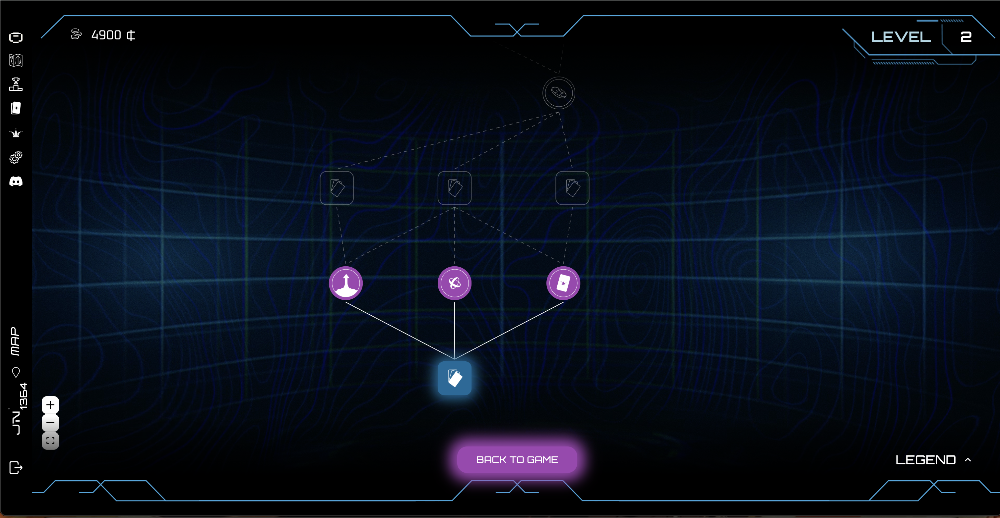

# The Shop

At the end of each round, players can spend the cash they've earned in The Shop. Each offers a distinct layout and item focus, see the table below for a breakdown.

In the shop, players can:

- Level up their plays to increase scoring potential.
- Purchase cards, including special cards, modifiers, traditional cards, and neon cards.
- Unlock slots for equipping more special cards.
- Buy power-ups, which can be used at any time.
- Open loot boxes that grant random cards.
- Burn unwanted cards from the deck to streamline strategy.

## Store Item Distribution

| Store         | Traditional Cards            | Modifier Cards               | Burn                         | Special Cards                | Power-ups                    | Loot Boxes                   | Play Level-ups               |
| ------------- | ---------------------------- | ---------------------------- | ---------------------------- | ---------------------------- | ---------------------------- | ---------------------------- | ---------------------------- |
| **Deck**      | 
✅
 | 
✅
 | 
✅
 | 
❌
 | 
❌
 | 
❌
 | 
❌
 |
| **Global**    | 
❌
 | 
❌
 | 
❌
 | 
✅
 | 
✅
 | 
❌
 | 
❌
 |
| **Specials**  | 
❌
 | 
❌
 | 
❌
 | 
✅
 | 
❌
 | 
✅
 | 
❌
 |
| **Level Ups** | 
❌
 | 
❌
 | 
❌
 | 
✅
 | 
❌
 | 
❌
 | 
✅
 |
| **Modifiers** | 
❌
 | 
✅
 | 
❌
 | 
❌
 | 
❌
 | 
✅
 | 
❌
 |
| **Mix**       | 
❌
 | 
❌
 | 
❌
 | 
❌
 | 
✅
 | 
✅
 | 
✅
 |

The items that appear in the store are completely random. For play upgrades and common cards, all have the same chance of appearing in the store. However, for special and modifier cards, The chance of appearing depends on the rarity of the card.

## Reroll

Players start the game with 1 reroll. Rerolls can be used to refresh the store's inventory. And after every Rage round, the player gains 2 additional rerolls.
